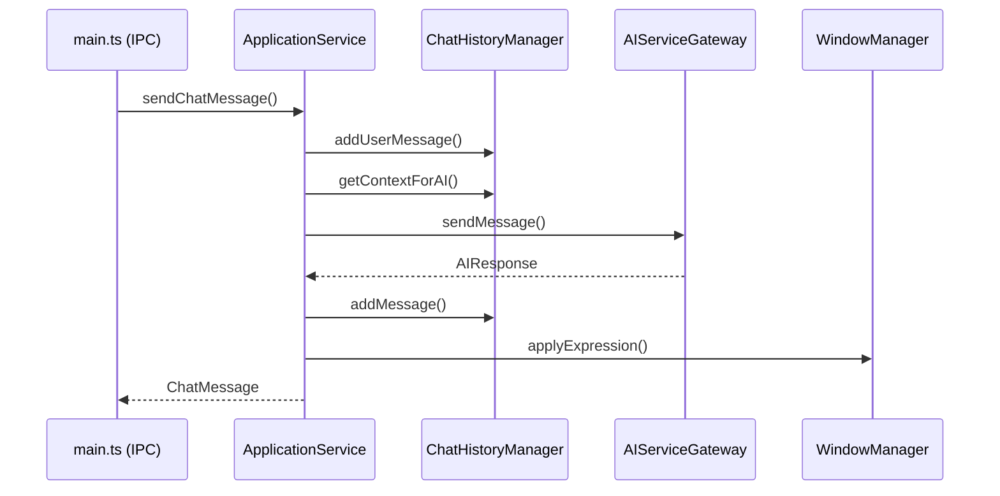
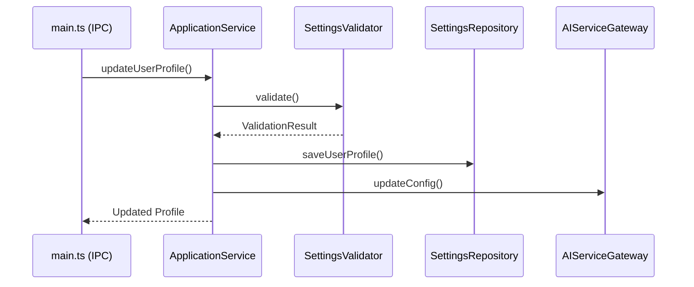
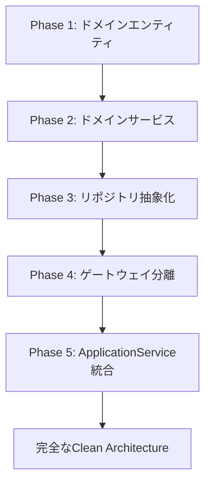

# アーキテクチャ設計書

## 概要

LLM Desktop MascotアプリケーションはClean Architecture原則に基づいて設計されており、依存関係の逆転、責務の分離、テスタビリティを重視した構造となっています。

## アーキテクチャ原則

### 1. Clean Architecture
- **依存関係の方向**: 外側の層から内側の層への一方向のみ
- **ドメイン独立性**: ビジネスロジックは外部フレームワークに依存しない
- **関心の分離**: 各層が明確に分離された責務を持つ

### 2. 設計原則
- **単一責任原則 (SRP)**: 各クラスは一つの責務のみを持つ
- **依存性逆転原則 (DIP)**: 高レベルモジュールが低レベルモジュールに依存しない
- **開放閉鎖原則 (OCP)**: 拡張に開放、修正に閉鎖
- **リスコフ置換原則 (LSP)**: 派生クラスが基底クラスと置換可能
- **インターフェース分離原則 (ISP)**: クライアントが不要なインターフェースに依存しない

## 層構造

```
┌─────────────────────────────────────────────────────────────┐
│                         Presentation                        │
│                     (main.ts, IPC)                        │
└─────────────────────────────────────────────────────────────┘
                              │
                              ▼
┌─────────────────────────────────────────────────────────────┐
│                        Application                          │
│                   (ApplicationService)                     │
└─────────────────────────────────────────────────────────────┘
                              │
                              ▼
┌─────────────────────────────────────────────────────────────┐
│                          Domain                             │
│            (Entities, Services, Repositories)              │
└─────────────────────────────────────────────────────────────┘
                              ▲
                              │
┌─────────────────────────────────────────────────────────────┐
│                      Infrastructure                        │
│                 (Gateways, Repositories)                  │
└─────────────────────────────────────────────────────────────┘
```

## ディレクトリ構成

```
src/
├── domain/                     # ドメイン層
│   ├── entities/               # ドメインエンティティ
│   │   ├── ChatMessage.ts      # チャットメッセージエンティティ
│   │   ├── UserProfile.ts      # ユーザープロファイルエンティティ
│   │   ├── CameraSettings.ts   # カメラ設定エンティティ
│   │   ├── ExpressionSettings.ts # 表情設定エンティティ
│   │   └── WindowSettings.ts   # ウィンドウ設定エンティティ
│   ├── value-objects/          # 値オブジェクト
│   │   └── WindowBounds.ts     # ウィンドウ境界値オブジェクト
│   ├── services/               # ドメインサービス
│   │   ├── SystemPromptBuilder.ts # システムプロンプト構築
│   │   ├── SettingsValidator.ts   # 設定値検証
│   │   ├── ChatHistoryManager.ts  # チャット履歴管理
│   │   └── FunctionCallOrchestrator.ts # Function Call管理
│   ├── repositories/           # リポジトリインターフェース
│   │   └── ISettingsRepository.ts # 設定関連リポジトリ群
│   └── gateways/               # ゲートウェイインターフェース
│       ├── IAIServiceGateway.ts    # AIサービス抽象化
│       ├── IWindowManagerGateway.ts # ウィンドウ管理抽象化
│       └── IFileSystemGateway.ts   # ファイルシステム抽象化
├── application/                # アプリケーション層
│   └── ApplicationService.ts   # アプリケーションサービス
└── infrastructure/             # インフラストラクチャ層
    ├── gateways/              # ゲートウェイ実装
    │   ├── GeminiServiceGateway.ts # Gemini API実装
    │   ├── ElectronWindowManagerGateway.ts # Electron実装
    │   └── NodeFileSystemGateway.ts # Node.js FS実装
    ├── repositories/          # リポジトリ実装
    │   ├── ElectronStoreSettingsRepository.ts
    │   └── FileChatHistoryRepository.ts
    ├── adapters/              # アダプター（既存システム統合）
    │   ├── SettingsStoreAdapter.ts     # 既存設定ストア統合
    │   ├── ChatHistoryStoreAdapter.ts  # 既存履歴ストア統合
    │   ├── ToolsServiceAdapter.ts      # 既存ツールサービス統合
    │   ├── WindowManagerAdapter.ts     # 既存ウィンドウ管理統合
    │   └── NodeFileSystemAdapter.ts    # Node.js FS統合
    └── DIContainer.ts         # 依存性注入コンテナ
```

## 主要コンポーネント

### ドメイン層

#### エンティティ
- **ChatMessage**: チャットメッセージの不変オブジェクト
  - ロール検証、タイムスタンプ管理、不変性保証
- **UserProfile**: ユーザー情報とマスコット設定
  - 名前検証、システムプロンプト管理、テーマ設定
- **CameraSettings**: 3Dカメラの位置、角度、ズーム設定
  - ベクトル計算、幾何学的操作、軌道カメラ制御
- **ExpressionSettings**: VRM表情の有効/無効とウェイト管理
  - 表情の動的制御、重み調整、フィルタリング機能
- **WindowSettings**: ウィンドウサイズプリセットと検証
  - アスペクト比検証、プリセット管理、動的リサイズ

#### 値オブジェクト
- **WindowBounds**: ウィンドウの位置とサイズ（不変）
  - 座標計算、画面境界チェック、相対位置操作

#### ドメインサービス
- **SystemPromptBuilder**: プロンプトテンプレート管理と変数置換
  - テンプレートエンジン、変数補間、セキュリティ検証
- **SettingsValidator**: 全設定項目の検証ルール一元化
  - 包括的検証、エラー詳細化、警告システム
- **ChatHistoryManager**: 会話履歴の管理と最適化
  - メモリ制限、コンテキスト最適化、履歴統計
- **FunctionCallOrchestrator**: AI Function Call の安全な実行管理
  - セキュリティポリシー、実行監視、結果フォーマット

### アプリケーション層

#### ApplicationService
- ドメインサービスとインフラストラクチャの調整
- ユースケースの実装（チャット送信、設定更新等）
- トランザクション境界の管理
- エラーハンドリングとロギング

### インフラストラクチャ層

#### ゲートウェイ実装
- **GeminiServiceGateway**: Google Gemini API との通信
  - ストリーミング対応、エラーハンドリング、レート制限
- **ElectronWindowManagerGateway**: Electronウィンドウ管理
  - マルチウィンドウ制御、イベント管理、状態同期
- **NodeFileSystemGateway**: Node.js ファイルシステム操作
  - 非同期IO、ファイル監視、バックアップ機能

#### アダプター
既存のクラスを新しいインターフェースにブリッジ:
- **SettingsStoreAdapter**: 既存SettingsStore → ISettingsRepository
- **ChatHistoryStoreAdapter**: 既存ChatHistoryStore → IChatHistoryRepository
- **WindowManagerAdapter**: 既存WindowManager → IWindowManagerGateway

## 依存性注入

### DIContainer設計
```typescript
class DIContainer {
  // シングルトンパターンでアプリケーション全体の依存関係を管理
  private static instance: DIContainer;
  
  async initialize(config: DIContainerConfig): Promise<void> {
    // 1. インフラストラクチャコンポーネントの作成
    // 2. ドメインサービスの初期化
    // 3. ApplicationServiceの構築
    // 4. 依存関係の配線
  }
}
```

### 設定例
```typescript
interface DIContainerConfig {
  geminiApiKey: string;
  isDevelopment: boolean;
  enableDevTools: boolean;
  enableAuditLog: boolean;
  logLevel: 'debug' | 'info' | 'warn' | 'error';
  maxChatHistory: number;
  autoSave: boolean;
  autoSaveInterval: number;
}
```

## データフロー

### チャットメッセージ送信フロー


### 設定更新フロー


## セキュリティ考慮事項

### Function Call セキュリティ
```typescript
interface FunctionCallSecurityConfig {
  enableWhitelist: boolean;
  allowedFunctions: string[];
  blockedFunctions: string[];
  maxExecutionTime: number;
  maxConcurrentCalls: number;
  enableAuditLog: boolean;
}
```

- **ホワイトリスト制御**: 許可された関数のみ実行
- **実行時間制限**: 無限ループ防止
- **引数検証**: 危険なパターンの検出
- **監査ログ**: 全実行の追跡記録

### 入力検証階層
1. **エンティティレベル**: コンストラクタでの基本検証
2. **ドメインサービス**: ビジネスルール検証
3. **アプリケーション層**: 総合的な整合性チェック
4. **プレゼンテーション層**: UI入力検証

## パフォーマンス最適化

### メモリ管理
```typescript
interface ChatHistoryConfig {
  maxMessages: number;        // 最大メッセージ数
  maxTokens: number;         // 最大トークン数
  contextWindow: number;     // AIコンテキストウィンドウ
  autoSummarize: boolean;    // 自動要約機能
}
```

### 非同期処理最適化
- **並列Function Call**: 独立した関数の同時実行
- **ストリーミング対応**: リアルタイム応答
- **レイジーロード**: 必要時のみリソース読み込み

## テスト戦略

### 単体テスト（ドメイン層）
```typescript
describe('ChatMessage', () => {
  describe('createUserMessage', () => {
    it('should create valid user message', () => {
      const message = ChatMessage.createUserMessage('Hello');
      expect(message.role).toBe('user');
      expect(message.content).toBe('Hello');
      expect(message.isValid()).toBe(true);
    });

    it('should reject empty content', () => {
      expect(() => ChatMessage.createUserMessage('')).toThrow();
    });
  });
});
```

### 統合テスト（アプリケーション層）
```typescript
describe('ApplicationService', () => {
  let app: ApplicationService;
  let mockAIGateway: jest.Mocked<IAIServiceGateway>;
  let mockRepository: jest.Mocked<ISettingsRepository>;
  
  beforeEach(() => {
    mockAIGateway = createMockAIGateway();
    mockRepository = createMockRepository();
    app = new ApplicationService(config, mockAIGateway, ...);
  });
  
  it('should handle chat message flow', async () => {
    const response = await app.sendChatMessage('Hello');
    
    expect(mockAIGateway.sendMessage).toHaveBeenCalled();
    expect(response.role).toBe('assistant');
  });
});
```

### E2Eテスト（システム全体）
```typescript
describe('Chat System E2E', () => {
  it('should complete full chat interaction', async () => {
    // 1. アプリケーション起動
    // 2. チャットメッセージ送信
    // 3. AI応答受信
    // 4. 表情変更確認
    // 5. 履歴保存確認
  });
});
```

## 移行戦略

### 段階的リファクタリング


### 後方互換性戦略
- **Adapterパターン**: 既存APIの保持
- **段階的移行**: 機能単位での切り替え
- **並行実行**: 新旧システムの一時共存

## 今後の拡張方針

### 短期的改善（次期リリース）
- [ ] マルチAIプロバイダー対応（OpenAI, Claude）
- [ ] リアルタイム設定同期
- [ ] 拡張されたFunction Call機能
- [ ] プラグインシステム基盤

### 中期的発展（6ヶ月以内）
- [ ] イベント駆動アーキテクチャ導入
- [ ] CQRS実装でのパフォーマンス向上
- [ ] クラウド同期機能
- [ ] 高度な感情分析機能

### 長期的ビジョン（1年以降）
- [ ] マイクロサービス化検討
- [ ] 分散システム対応
- [ ] AI学習フィードバックループ
- [ ] エンタープライズ機能（RBAC、監査等）

## 運用・保守

### ログ管理
```typescript
interface StructuredLog {
  timestamp: string;
  level: 'debug' | 'info' | 'warn' | 'error';
  component: string;
  message: string;
  context?: Record<string, any>;
  traceId?: string;
}
```

### エラー分類
- **回復可能エラー**: 自動リトライで解決
- **設定エラー**: ユーザー操作で修正可能
- **システムエラー**: 開発者による修正が必要
- **致命的エラー**: アプリケーション再起動が必要

### モニタリング指標
- **機能メトリクス**: 応答時間、成功率、エラー率
- **リソースメトリクス**: CPU、メモリ、ディスク使用量
- **ビジネスメトリクス**: チャット数、Function Call実行数
- **ユーザーエクスペリエンス**: UI応答性、満足度

## 開発ガイドライン

### コーディング規約
- **TypeScript Strict Mode**: 型安全性の確保
- **ESLint設定**: 一貫したコードスタイル
- **Prettier**: 自動フォーマット
- **命名規約**: 意図を明確にする命名

### コミット規約
```
type(scope): description

例:
feat(domain): add ChatMessage entity
fix(infrastructure): resolve memory leak in ChatHistoryStore
refactor(application): improve error handling in ApplicationService
```

### プルリクエスト要件
- [ ] 単体テストの追加/更新
- [ ] 統合テストの実行確認
- [ ] アーキテクチャ原則の遵守
- [ ] セキュリティ考慮事項の確認
- [ ] パフォーマンス影響の評価

---

## 参考資料

- [Clean Architecture - Robert C. Martin](https://blog.cleancoder.com/uncle-bob/2012/08/13/the-clean-architecture.html)
- [Domain-Driven Design Reference](https://domainlanguage.com/ddd/reference/)
- [TypeScript Best Practices](https://typescript-eslint.io/rules/)
- [Electron Architecture Guide](https://www.electronjs.org/docs/latest/tutorial/architecture)
- [Node.js Best Practices](https://github.com/goldbergyoni/nodebestpractices)

---

*このドキュメントは継続的に更新され、アーキテクチャの進化とともに改訂されます。質問や改善提案がある場合は、GitHubのIssueまたはPull Requestでお知らせください。*