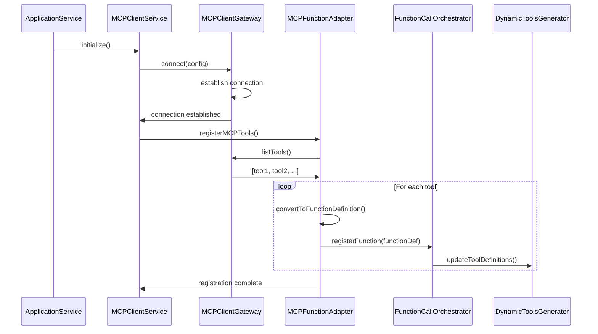
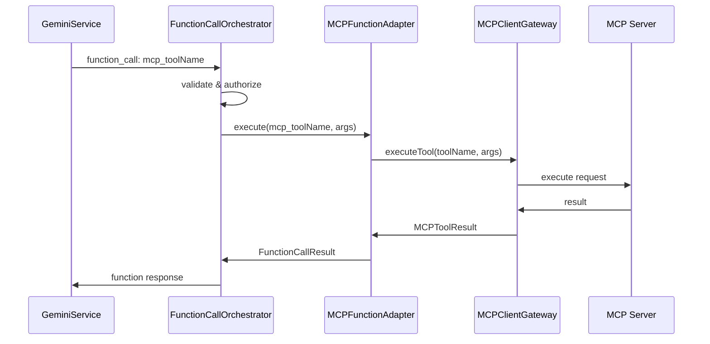

# MCP Client Design Document
MCPクライアント設計書

Phase: Design | 設計フェーズ
Date: 2025-06-04

## 1. Overview / 概要

This document describes the design and implementation plan for integrating Model Context Protocol (MCP) client functionality into the desktop mascot application. The MCP client will enable the AI (Gemini) to utilize MCP server functions as Function Calling Tools, providing extensible integration with various external services.

このドキュメントは、デスクトップマスコットアプリケーションにModel Context Protocol (MCP)クライアント機能を統合するための設計と実装計画を記述しています。MCPクライアントにより、AI（Gemini）がMCPサーバー機能をFunction Calling Toolsとして利用できるようになり、様々な外部サービスとの拡張可能な統合が可能になります。

## 2. Background and Requirements / 背景と要件

### 2.1 Current Architecture Analysis / 現在のアーキテクチャ分析

The application currently implements:
- **Clean Architecture** with clear separation of concerns
- **Service-Oriented Design** with 7 specialized services
- **Hybrid Architecture**: React UI + Three.js + Electron
- **Static Function Calling** via tools.json configuration

現在のFunction Calling実装:
```
src/
├── domain/services/
│   └── FunctionCallOrchestrator.ts    # セキュリティ、検証、実行管理
├── services/
│   └── toolsService.ts                # tools.json管理、Gemini形式変換
├── infrastructure/gateways/
│   └── GeminiServiceGateway.ts        # Gemini API統合
└── config/
    └── tools.json                     # 静的ツール定義
```

### 2.2 Requirements Summary / 要件サマリー

**Must Have (必須機能)**:
- ✅ Generic MCP client module implementation
- ✅ Connection management to MCP servers
- ✅ Well-formed request/response handling
- ✅ Error handling and logging
- ✅ Configuration management
- ✅ Dynamic function discovery for AI
- ✅ Integration with existing Function Calling framework

**Should Have (推奨機能)**:
- ⚠️ Multiple MCP server support
- ⚠️ Advanced authentication methods

**Nice to Have (将来機能)**:
- ❌ MCP server discovery
- ❌ Custom protocol extensions

## 3. Architecture Design / アーキテクチャ設計

### 3.1 Component Placement / コンポーネント配置

```
┌─────────────────────────────────────────────────────────────┐
│                    Presentation Layer                        │
│                  (React UI, Three.js)                        │
└────────────────────────────┬────────────────────────────────┘
                             │ Electron IPC
┌────────────────────────────▼────────────────────────────────┐
│                    Service Layer                             │
│          (7 Specialized Services + ToolsService)            │
└────────────────────────────┬────────────────────────────────┘
                             │
┌────────────────────────────▼────────────────────────────────┐
│                  Application Layer                           │
│     ApplicationService ← MCPClientService (NEW)             │
└────────────────────────────┬────────────────────────────────┘
                             │
┌────────────────────────────▼────────────────────────────────┐
│                    Domain Layer                              │
│  ┌─────────────────────────────────────────────────────┐   │
│  │ Entities │ Services │ Gateways │ Value Objects      │   │
│  │         FunctionCallOrchestrator                     │   │
│  │         MCPFunctionAdapter (NEW)                    │   │
│  │         IMCPServiceGateway (NEW)                    │   │
│  └─────────────────────────────────────────────────────┘   │
└────────────────────────────┬────────────────────────────────┘
                             │ Dependency Inversion
┌────────────────────────────▼────────────────────────────────┐
│                 Infrastructure Layer                         │
│  ┌─────────────────────────────────────────────────────┐   │
│  │ Gateways: MCPClientGateway (NEW)                    │   │
│  │ Adapters: MCPToolsAdapter (NEW)                     │   │
│  │ Repositories, External Services                      │   │
│  └─────────────────────────────────────────────────────┘   │
└──────────────────────────────────────────────────────────────┘
```

### 3.2 New Components / 新規コンポーネント

#### Domain Layer Components

**IMCPServiceGateway** (Domain Gateway Interface)
```typescript
// src/domain/gateways/IMCPServiceGateway.ts
export interface IMCPServiceGateway {
  connect(config: MCPConnectionConfig): Promise<void>;
  disconnect(): Promise<void>;
  listTools(): Promise<MCPTool[]>;
  executeTool(name: string, args: any): Promise<MCPToolResult>;
  getCapabilities(): Promise<MCPCapabilities>;
  isConnected(): boolean;
  on(event: MCPEvent, handler: (data: any) => void): void;
  off(event: MCPEvent, handler: (data: any) => void): void;
}

export interface MCPConnectionConfig {
  id: string;
  type: 'websocket' | 'http' | 'stdio';
  endpoint: string;
  auth?: MCPAuthConfig;
  timeout?: number;
  retryConfig?: MCPRetryConfig;
}

export interface MCPTool {
  name: string;
  description: string;
  inputSchema: object;
  outputSchema?: object;
  capabilities?: string[];
}
```

**MCPFunctionAdapter** (Domain Service)
```typescript
// src/domain/services/MCPFunctionAdapter.ts
export class MCPFunctionAdapter {
  constructor(
    private orchestrator: FunctionCallOrchestrator,
    private mcpGateway: IMCPServiceGateway
  ) {}

  async registerMCPTools(): Promise<void> {
    const tools = await this.mcpGateway.listTools();
    
    for (const tool of tools) {
      const functionDef = this.convertToFunctionDefinition(tool);
      await this.orchestrator.registerFunction(functionDef);
    }
  }

  private convertToFunctionDefinition(tool: MCPTool): FunctionDefinition {
    return {
      name: `mcp_${tool.name}`,
      description: tool.description,
      parameters: tool.inputSchema,
      category: 'mcp',
      handler: async (args: any) => {
        return await this.mcpGateway.executeTool(tool.name, args);
      }
    };
  }
}
```

#### Application Layer Components

**MCPClientService** (Application Service)
```typescript
// src/application/MCPClientService.ts
export class MCPClientService {
  private connections: Map<string, IMCPServiceGateway> = new Map();

  constructor(
    private settingsRepository: ISettingsRepository,
    private mcpAdapter: MCPFunctionAdapter,
    private logger: Logger
  ) {}

  async initialize(): Promise<void> {
    const settings = await this.settingsRepository.getSettings();
    const mcpConfigs = settings.mcpServers || [];

    for (const config of mcpConfigs) {
      if (config.enabled) {
        await this.connectToServer(config);
      }
    }
  }

  async connectToServer(config: MCPServerConfig): Promise<void> {
    try {
      const gateway = DIContainer.resolve<IMCPServiceGateway>('MCPServiceGateway');
      await gateway.connect(config);
      
      this.connections.set(config.id, gateway);
      await this.mcpAdapter.registerMCPTools();
      
      this.logger.info(`Connected to MCP server: ${config.name}`);
    } catch (error) {
      this.logger.error(`Failed to connect to MCP server: ${config.name}`, error);
      throw error;
    }
  }
}
```

#### Infrastructure Layer Components

**MCPClientGateway** (Infrastructure Implementation)
```typescript
// src/infrastructure/gateways/MCPClientGateway.ts
export class MCPClientGateway implements IMCPServiceGateway {
  private connection: WebSocket | null = null;
  private eventEmitter = new EventEmitter();
  private reconnectTimer: NodeJS.Timeout | null = null;

  async connect(config: MCPConnectionConfig): Promise<void> {
    switch (config.type) {
      case 'websocket':
        await this.connectWebSocket(config);
        break;
      case 'http':
        await this.connectHTTP(config);
        break;
      case 'stdio':
        await this.connectStdio(config);
        break;
    }
  }

  private async connectWebSocket(config: MCPConnectionConfig): Promise<void> {
    return new Promise((resolve, reject) => {
      const ws = new WebSocket(config.endpoint);
      
      ws.on('open', async () => {
        this.connection = ws;
        await this.authenticate(config.auth);
        this.setupMessageHandlers();
        resolve();
      });

      ws.on('error', reject);
      ws.on('close', () => this.handleDisconnect(config));
    });
  }

  async listTools(): Promise<MCPTool[]> {
    const response = await this.sendRequest('listTools', {});
    return response.tools.map(this.normalizeTool);
  }

  async executeTool(name: string, args: any): Promise<MCPToolResult> {
    const response = await this.sendRequest('executeTool', { name, args });
    return this.normalizeResult(response);
  }
}
```

## 4. Integration Flow / 統合フロー

### 4.1 Dynamic Function Registration / 動的Function登録



### 4.2 Function Execution Flow / Function実行フロー



## 5. Configuration Management / 設定管理

### 5.1 Settings Structure / 設定構造

```typescript
// Extension to existing settings
interface ApplicationSettings {
  // ... existing settings ...
  
  mcpSettings: MCPClientSettings;
}

interface MCPClientSettings {
  enabled: boolean;
  servers: MCPServerConfig[];
  defaultTimeout: number;
  maxRetries: number;
  enableAutoReconnect: boolean;
}

interface MCPServerConfig {
  id: string;
  name: string;
  type: 'websocket' | 'http' | 'stdio';
  endpoint: string;
  auth?: {
    type: 'bearer' | 'basic' | 'custom';
    credentials: any; // Encrypted in storage
  };
  enabled: boolean;
  capabilities?: string[];
  priority?: number;
}
```

### 5.2 UI Integration / UI統合

Settings window will include a new "MCP Servers" tab:

```typescript
// src/renderer/components/settings/MCPSettingsTab.tsx
export const MCPSettingsTab: React.FC = () => {
  const { mcpSettings, updateMCPSettings } = useSettingsSection('mcpSettings');
  
  return (
    <Card>
      <CardHeader>
        <h3>MCP Server Settings</h3>
      </CardHeader>
      <CardContent>
        <ServerList 
          servers={mcpSettings.servers}
          onUpdate={updateMCPSettings}
        />
        <AddServerDialog />
      </CardContent>
    </Card>
  );
};
```

## 6. Security Considerations / セキュリティ考慮事項

### 6.1 Connection Security / 接続セキュリティ

- **TLS/SSL Enforcement**: WebSocket connections must use `wss://` protocol
- **Certificate Validation**: Verify server certificates
- **Authentication**: Support multiple auth methods with secure credential storage

### 6.2 Execution Security / 実行セキュリティ

- **Function Allowlist**: Pre-approval required for MCP functions
- **Argument Validation**: Leverage existing `validateHighSecurityFunction`
- **Execution Limits**: Use existing `maxExecutionTime` constraints
- **Audit Logging**: All MCP function executions logged

```typescript
// Security validation example
class MCPSecurityValidator {
  private allowedFunctions: Set<string> = new Set();
  
  async validateFunction(tool: MCPTool): Promise<boolean> {
    // Check against allowlist
    if (!this.allowedFunctions.has(tool.name)) {
      return false;
    }
    
    // Validate schema doesn't contain dangerous patterns
    if (this.containsDangerousPatterns(tool.inputSchema)) {
      return false;
    }
    
    return true;
  }
}
```

### 6.3 Data Security / データセキュリティ

- **Credential Encryption**: Use Electron's safeStorage API
- **Response Validation**: Strict schema validation for MCP responses
- **Sandboxing**: Consider process isolation for MCP execution

## 7. Testing Strategy / テスト戦略

### 7.1 Unit Tests / ユニットテスト

```typescript
// src/domain/services/__tests__/MCPFunctionAdapter.test.ts
describe('MCPFunctionAdapter', () => {
  it('should convert MCP tool to function definition', async () => {
    const mockTool: MCPTool = {
      name: 'test_tool',
      description: 'Test tool',
      inputSchema: { type: 'object', properties: {} }
    };
    
    const adapter = new MCPFunctionAdapter(mockOrchestrator, mockGateway);
    const functionDef = adapter.convertToFunctionDefinition(mockTool);
    
    expect(functionDef.name).toBe('mcp_test_tool');
    expect(functionDef.category).toBe('mcp');
  });
});
```

### 7.2 Integration Tests / 統合テスト

```typescript
// src/infrastructure/gateways/__tests__/MCPClientGateway.test.ts
describe('MCPClientGateway', () => {
  it('should handle connection lifecycle', async () => {
    const gateway = new MCPClientGateway();
    const config: MCPConnectionConfig = {
      id: 'test',
      type: 'websocket',
      endpoint: 'ws://localhost:8080'
    };
    
    await gateway.connect(config);
    expect(gateway.isConnected()).toBe(true);
    
    await gateway.disconnect();
    expect(gateway.isConnected()).toBe(false);
  });
});
```

### 7.3 E2E Tests / E2Eテスト

```typescript
// tests/e2e/mcp-integration.spec.ts
test.describe('MCP Integration', () => {
  test('should configure and connect to MCP server', async ({ page }) => {
    // Open settings
    await page.click('[data-testid="settings-button"]');
    
    // Navigate to MCP tab
    await page.click('[data-testid="mcp-settings-tab"]');
    
    // Add new server
    await page.click('[data-testid="add-mcp-server"]');
    await page.fill('[data-testid="server-endpoint"]', 'ws://localhost:8080');
    await page.click('[data-testid="save-server"]');
    
    // Verify connection
    await expect(page.locator('[data-testid="server-status"]')).toHaveText('Connected');
  });
});
```

## 8. Implementation Roadmap / 実装ロードマップ

### Phase 1: Foundation (Week 1) / 基盤実装
- [ ] Create IMCPServiceGateway interface (TDD: Red phase)
- [ ] Implement basic MCPClientGateway (TDD: Green phase)
- [ ] Add connection management (WebSocket)
- [ ] Implement error handling and reconnection

### Phase 2: Tool Management (Week 2) / ツール管理
- [ ] Implement MCPFunctionAdapter (TDD approach)
- [ ] Add tool discovery (listTools)
- [ ] Create dynamic function registration
- [ ] Integrate with FunctionCallOrchestrator

### Phase 3: Execution (Week 3) / 実行機能
- [ ] Implement tool execution (executeTool)
- [ ] Add result normalization
- [ ] Implement security validation
- [ ] Add comprehensive error handling

### Phase 4: UI & Configuration (Week 4) / UI・設定
- [ ] Create MCPSettingsTab component
- [ ] Implement server configuration UI
- [ ] Add connection status indicators
- [ ] Create E2E tests for full flow

## 9. Future Enhancements / 将来の拡張

### 9.1 Phase 2 Features
- Multiple concurrent MCP server connections
- Advanced authentication (OAuth, mTLS)
- Connection pooling and load balancing
- MCP server health monitoring

### 9.2 Phase 3 Features
- MCP server discovery (mDNS, registry)
- Custom protocol extensions
- Performance optimizations (caching, batching)
- Advanced security sandboxing

## 10. References / 参照

- [Model Context Protocol Specification](https://github.com/modelcontextprotocol/specification)
- [ARCHITECTURE_V2.md](../ARCHITECTURE_V2.md) - Application architecture documentation
- [DEVELOPER_GUIDE.md](../DEVELOPER_GUIDE.md) - Development guidelines
- [CLAUDE.md](../CLAUDE.md) - AI assistant instructions

## 11. Document History / 更新履歴

- 2025-06-04: Initial design document created
- Phase: Design (Not yet implemented)

---

*Note: This design document is pending review and approval before implementation begins.*
*注：この設計書は実装開始前のレビューと承認待ちです。*