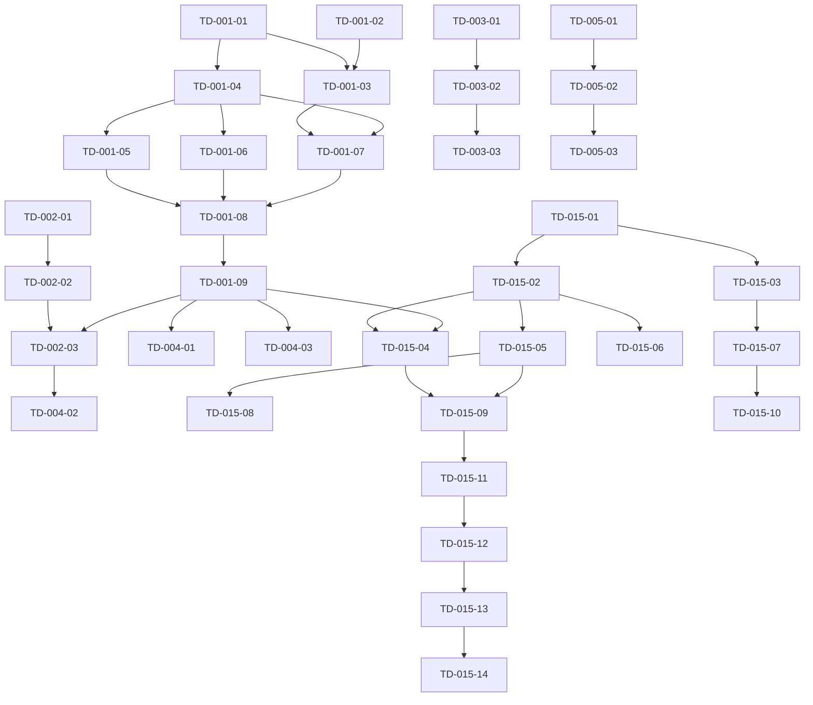

# 技術的負債解消プラン

**作成日**: 2025年6月5日  
**バージョン**: 1.0  
**ステータス**: ⚠️ **参考文書** - FSD移行決定により上位計画が存在

## 🎯 重要なお知らせ

**このドキュメントは参考資料となりました。**

2025年6月5日にFeature-Sliced Design移行が最高優先として決定されたため、このClean Architecture改善プランは実行されません。

### 📁 最新の実行計画
- **[docs/fsd-migration/MIGRATION_PLAN.md](./fsd-migration/MIGRATION_PLAN.md)** - 最新の移行計画
- **[docs/fsd-migration/MIGRATION_TICKETS.md](./fsd-migration/MIGRATION_TICKETS.md)** - 実際の実行チケット

### 📚 このドキュメントの価値
- Clean Architectureでの技術的負債解決手法の参考
- 将来的なアーキテクチャ判断の教訓
- チケット分割手法の参考事例

このドキュメントは、[TECHNICAL_DEBT.md](./TECHNICAL_DEBT.md)で識別された技術的負債を解消するための具体的なアクションプランです。

---

## 📋 チケット管理ルール

1. **チケットID形式**: `TD-XXX-YY` (例: TD-001-01)
   - XXX: 技術的負債番号
   - YY: サブタスク番号

2. **チケット粒度**: 
   - 1-2時間で完了可能
   - 扱うファイル数は3-5個まで
   - 独立してテスト可能

3. **実装原則**:
   - TDD必須（RED → GREEN → REFACTOR）
   - アーキテクチャ準拠
   - 依存関係の明示

---

## 🎯 TD-001: マウス追従機能のアーキテクチャ違反

### 概要
マウス追従機能をClean Architectureに準拠した実装に修正する。

### チケット一覧

#### TD-001-01: MousePositionエンティティの作成
**優先度**: 🔴 高  
**推定時間**: 1時間  
**依存**: なし

**実装内容**:
```typescript
// src/domain/entities/MousePosition.test.ts
// src/domain/entities/MousePosition.ts
```

**受け入れ基準**:
- [ ] スクリーン座標を保持
- [ ] タイムスタンプを含む
- [ ] 座標の妥当性検証
- [ ] 距離計算メソッド
- [ ] テストカバレッジ100%

---

#### TD-001-02: HeadOrientationバリューオブジェクトの作成
**優先度**: 🔴 高  
**推定時間**: 1時間  
**依存**: なし

**実装内容**:
```typescript
// src/domain/value-objects/HeadOrientation.test.ts
// src/domain/value-objects/HeadOrientation.ts
```

**受け入れ基準**:
- [ ] Pitch/Yaw/Rollの保持
- [ ] 角度制限の適用
- [ ] Quaternion変換
- [ ] スムージング計算
- [ ] テストカバレッジ100%

---

#### TD-001-03: MouseFollowDomainServiceの作成
**優先度**: 🔴 高  
**推定時間**: 2時間  
**依存**: TD-001-01, TD-001-02

**実装内容**:
```typescript
// src/domain/services/MouseFollowDomainService.test.ts
// src/domain/services/MouseFollowDomainService.ts
```

**受け入れ基準**:
- [ ] マウス位置から頭部方向を計算
- [ ] 首と頭の回転比率を適用（70:30）
- [ ] 回転制限の適用
- [ ] ビジネスロジックの集約
- [ ] テストカバレッジ100%

---

#### TD-001-04: ゲートウェイインターフェースの定義
**優先度**: 🔴 高  
**推定時間**: 30分  
**依存**: TD-001-01

**実装内容**:
```typescript
// src/domain/gateways/IMousePositionGateway.ts
// src/domain/gateways/IVRMControlGateway.ts
```

**受け入れ基準**:
- [ ] マウス位置取得インターフェース
- [ ] VRM制御インターフェース
- [ ] エラー処理の定義
- [ ] 非同期処理の考慮

---

#### TD-001-05: ElectronMousePositionGatewayの実装
**優先度**: 🔴 高  
**推定時間**: 1.5時間  
**依存**: TD-001-04

**実装内容**:
```typescript
// src/infrastructure/gateways/ElectronMousePositionGateway.test.ts
// src/infrastructure/gateways/ElectronMousePositionGateway.ts
```

**受け入れ基準**:
- [ ] screen.getCursorScreenPoint()のラップ
- [ ] エラーハンドリング
- [ ] マルチディスプレイ対応
- [ ] モック可能な実装
- [ ] テストカバレッジ100%

---

#### TD-001-06: VRMControlGatewayAdapterの実装
**優先度**: 🔴 高  
**推定時間**: 1.5時間  
**依存**: TD-001-04

**実装内容**:
```typescript
// src/infrastructure/adapters/VRMControlGatewayAdapter.test.ts
// src/infrastructure/adapters/VRMControlGatewayAdapter.ts
```

**受け入れ基準**:
- [ ] 既存VRMControllerのラップ
- [ ] ボーン制御の抽象化
- [ ] エラーハンドリング
- [ ] テストカバレッジ100%

---

#### TD-001-07: MouseFollowUseCaseの実装
**優先度**: 🔴 高  
**推定時間**: 2時間  
**依存**: TD-001-03, TD-001-04

**実装内容**:
```typescript
// src/application/use-cases/MouseFollowUseCase.test.ts
// src/application/use-cases/MouseFollowUseCase.ts
```

**受け入れ基準**:
- [ ] ユースケースのオーケストレーション
- [ ] 状態管理との連携
- [ ] 開始/停止制御
- [ ] エラーハンドリング
- [ ] テストカバレッジ100%

---

#### TD-001-08: DIContainerの更新
**優先度**: 🔴 高  
**推定時間**: 1時間  
**依存**: TD-001-05, TD-001-06, TD-001-07

**実装内容**:
```typescript
// src/infrastructure/DIContainer.ts の更新
```

**受け入れ基準**:
- [ ] 新規クラスの登録
- [ ] 依存関係の設定
- [ ] 初期化順序の考慮
- [ ] 既存機能への影響なし

---

#### TD-001-09: VRMSetupManagerのリファクタリング
**優先度**: 🔴 高  
**推定時間**: 2時間  
**依存**: TD-001-07, TD-001-08

**実装内容**:
```typescript
// src/services/vrmSetupManager.ts のリファクタリング
// 既存機能の移行テスト
```

**受け入れ基準**:
- [ ] マウス追従ロジックの削除
- [ ] MouseFollowUseCaseへの委譲
- [ ] 既存機能の維持
- [ ] 回帰テストの成功

---

## 🎯 TD-002: MascotStateManagerの不適切な配置

### チケット一覧

#### TD-002-01: MascotStateエンティティの作成
**優先度**: 🟡 中  
**推定時間**: 1時間  
**依存**: なし

**実装内容**:
```typescript
// src/domain/entities/MascotState.test.ts
// src/domain/entities/MascotState.ts
```

**受け入れ基準**:
- [ ] 状態の定義（表情、アニメーション、スピーチバブル）
- [ ] 状態遷移ルール
- [ ] アイドル判定ロジック
- [ ] テストカバレッジ100%

---

#### TD-002-02: MascotStateDomainServiceの作成
**優先度**: 🟡 中  
**推定時間**: 1.5時間  
**依存**: TD-002-01

**実装内容**:
```typescript
// src/domain/services/MascotStateDomainService.test.ts
// src/domain/services/MascotStateDomainService.ts
```

**受け入れ基準**:
- [ ] 状態管理ロジックの実装
- [ ] イベント通知メカニズム
- [ ] 状態の一貫性保証
- [ ] テストカバレッジ100%

---

#### TD-002-03: 既存MascotStateManagerのリファクタリング
**優先度**: 🟡 中  
**推定時間**: 2時間  
**依存**: TD-002-02, TD-001-09

**実装内容**:
```typescript
// src/services/MascotStateManager.ts のリファクタリング
// DIContainerへの統合
```

**受け入れ基準**:
- [ ] シングルトンから依存性注入へ
- [ ] ドメインサービスへの委譲
- [ ] 既存APIの維持
- [ ] 回帰テストの成功

---

## 🎯 TD-003: アイドルアニメーション判定のハードコーディング

### チケット一覧

#### TD-003-01: AnimationConfigエンティティの作成
**優先度**: 🟢 低  
**推定時間**: 1時間  
**依存**: なし

**実装内容**:
```typescript
// src/domain/entities/AnimationConfig.test.ts
// src/domain/entities/AnimationConfig.ts
```

**受け入れ基準**:
- [ ] アニメーション設定の定義
- [ ] カテゴリー管理（idle, action等）
- [ ] 設定の検証ロジック
- [ ] テストカバレッジ100%

---

#### TD-003-02: AnimationCategoryServiceの実装
**優先度**: 🟢 低  
**推定時間**: 1時間  
**依存**: TD-003-01

**実装内容**:
```typescript
// src/domain/services/AnimationCategoryService.test.ts
// src/domain/services/AnimationCategoryService.ts
```

**受け入れ基準**:
- [ ] カテゴリー判定ロジック
- [ ] 設定ベースの判定
- [ ] デフォルト値の管理
- [ ] テストカバレッジ100%

---

#### TD-003-03: VRMControllerの更新
**優先度**: 🟢 低  
**推定時間**: 1.5時間  
**依存**: TD-003-02

**実装内容**:
```typescript
// src/vrmController.ts の更新
// ハードコーディングの除去
```

**受け入れ基準**:
- [ ] ハードコーディングの削除
- [ ] AnimationCategoryServiceの使用
- [ ] 既存機能の維持
- [ ] 回帰テストの成功

---

## 🎯 TD-004: テストカバレッジの不足

### チケット一覧

#### TD-004-01: VRMSetupManagerのテスト作成
**優先度**: 🟡 中  
**推定時間**: 2時間  
**依存**: TD-001-09

**実装内容**:
```typescript
// src/services/vrmSetupManager.test.ts の作成/更新
```

**受け入れ基準**:
- [ ] 主要メソッドのテスト
- [ ] エッジケースのカバー
- [ ] モックの適切な使用
- [ ] カバレッジ80%以上

---

#### TD-004-02: MascotStateManagerのテスト作成
**優先度**: 🟡 中  
**推定時間**: 1.5時間  
**依存**: TD-002-03

**実装内容**:
```typescript
// src/services/MascotStateManager.test.ts の作成/更新
```

**受け入れ基準**:
- [ ] 全パブリックメソッドのテスト
- [ ] 状態遷移のテスト
- [ ] イベント通知のテスト
- [ ] カバレッジ90%以上

---

#### TD-004-03: マウス追従E2Eテストの作成
**優先度**: 🟡 中  
**推定時間**: 2時間  
**依存**: TD-001-09

**実装内容**:
```typescript
// tests/e2e/mouse-follow/mouse-follow-integration.spec.ts
```

**受け入れ基準**:
- [ ] 基本的なマウス追従動作
- [ ] 状態による制御のテスト
- [ ] エラーケースのテスト
- [ ] スクリーンショット取得

---

## 🎯 TD-005: 設定UIの未実装

### チケット一覧

#### TD-005-01: MouseFollowSettingsTabコンポーネントの作成
**優先度**: 🟡 中  
**推定時間**: 2時間  
**依存**: なし

**実装内容**:
```typescript
// src/renderer/components/settings/MouseFollowSettingsTab.test.tsx
// src/renderer/components/settings/MouseFollowSettingsTab.tsx
```

**受け入れ基準**:
- [ ] ON/OFFトグル
- [ ] 感度スライダー
- [ ] スムージング設定
- [ ] リアルタイムプレビュー
- [ ] テストカバレッジ80%以上

---

#### TD-005-02: 設定の永続化実装
**優先度**: 🟡 中  
**推定時間**: 1.5時間  
**依存**: TD-005-01

**実装内容**:
```typescript
// src/utils/settingsStore.ts の更新
// マウス追従設定の追加
```

**受け入れ基準**:
- [ ] 設定の保存/読み込み
- [ ] デフォルト値の管理
- [ ] 型安全性の確保
- [ ] 既存設定との互換性

---

#### TD-005-03: IPCハンドラーの実装
**優先度**: 🟡 中  
**推定時間**: 1時間  
**依存**: TD-005-02

**実装内容**:
```typescript
// src/main/ipc/handlers/MouseFollowHandler.ts
// IPCチャンネルの定義
```

**受け入れ基準**:
- [ ] 設定の同期
- [ ] リアルタイム更新
- [ ] エラーハンドリング
- [ ] テストカバレッジ80%以上

---

## 🎯 TD-008: ESLint設定エラーとLinter警告

### チケット一覧

#### TD-008-01: ESLint設定の修正
**優先度**: 🔴 高  
**推定時間**: 1時間  
**依存**: なし

**実装内容**:
```typescript
// eslint.config.js の修正
// package.json の更新
```

**受け入れ基準**:
- [ ] react-hooksプラグインエラーの解消
- [ ] ESLint実行成功
- [ ] 設定ファイルの型エラー解消
- [ ] CI/CDでのLint実行確認

---

#### TD-008-02: console文の整理
**優先度**: 🔴 高  
**推定時間**: 3時間  
**依存**: TD-008-01

**実装内容**:
```typescript
// src/services/logger.ts の活用
// 130ファイルのconsole文置換
```

**受け入れ基準**:
- [ ] ロガーサービスへの統一
- [ ] 開発/本番環境での出力制御
- [ ] デバッグレベルの設定
- [ ] 既存機能への影響なし

---

#### TD-008-03: Lintルールの最適化
**優先度**: 🔴 高  
**推定時間**: 1時間  
**依存**: TD-008-02

**実装内容**:
```typescript
// eslint.config.js のルール調整
// .eslintignore の更新
```

**受け入れ基準**:
- [ ] no-consoleルールの適切な設定
- [ ] 警告/エラーレベルの調整
- [ ] チーム合意のルール設定
- [ ] ドキュメント更新

---

## 🎯 TD-009: any型の過剰使用

### チケット一覧

#### TD-009-01: 型定義ファイルの作成
**優先度**: 🔴 高  
**推定時間**: 2時間  
**依存**: なし

**実装内容**:
```typescript
// src/types/events.ts
// src/types/api.ts
// src/types/electron.ts
```

**受け入れ基準**:
- [ ] イベントハンドラー型の定義
- [ ] APIレスポンス型の定義
- [ ] Electron IPC型の定義
- [ ] 既存コードとの互換性

---

#### TD-009-02: イベントハンドラーの型付け
**優先度**: 🔴 高  
**推定時間**: 3時間  
**依存**: TD-009-01

**実装内容**:
```typescript
// 全イベントハンドラーの型付け
// React.MouseEvent, React.ChangeEvent等の使用
```

**受け入れ基準**:
- [ ] onClick, onChange等の型付け
- [ ] カスタムイベントの型定義
- [ ] 型推論の活用
- [ ] any型の削除（50%以上）

---

#### TD-009-03: APIレスポンスの型付け
**優先度**: 🔴 高  
**推定時間**: 2時間  
**依存**: TD-009-01

**実装内容**:
```typescript
// API通信部分の型付け
// Zodによるランタイム検証
```

**受け入れ基準**:
- [ ] fetch/axiosレスポンスの型付け
- [ ] エラーレスポンスの型定義
- [ ] 型ガードの実装
- [ ] any型の削除（30%以上）

---

#### TD-009-04: 残存any型の段階的解消
**優先度**: 🔴 高  
**推定時間**: 4時間  
**依存**: TD-009-02, TD-009-03

**実装内容**:
```typescript
// 残りのany型を順次解消
// unknown型への移行
```

**受け入れ基準**:
- [ ] 優先度の高い箇所から解消
- [ ] unknown型の適切な使用
- [ ] 型アサーションの最小化
- [ ] any型使用箇所を50ファイル以下に

---

## 🎯 TD-010: テストカバレッジの不均衡

### チケット一覧

#### TD-010-01: テスト戦略の策定
**優先度**: 🔴 高  
**推定時間**: 1時間  
**依存**: なし

**実装内容**:
```markdown
// docs/TESTING_STRATEGY.md
// テスト優先順位リスト
```

**受け入れ基準**:
- [ ] 重要度によるファイル分類
- [ ] テストタイプの定義
- [ ] カバレッジ目標設定
- [ ] 実装計画の作成

---

#### TD-010-02: 重要サービスのテスト作成
**優先度**: 🔴 高  
**推定時間**: 8時間  
**依存**: TD-010-01

**実装内容**:
```typescript
// 優先度の高いサービスのテスト
// 10-15ファイル
```

**受け入れ基準**:
- [ ] ビジネスロジックのテスト
- [ ] エッジケースのカバー
- [ ] モックの適切な使用
- [ ] カバレッジ70%以上

---

#### TD-010-03: 統合テストの追加
**優先度**: 🔴 高  
**推定時間**: 6時間  
**依存**: TD-010-02

**実装内容**:
```typescript
// tests/integration/ 配下
// サービス間連携テスト
```

**受け入れ基準**:
- [ ] 主要な統合ポイント
- [ ] IPC通信のテスト
- [ ] エラー伝播のテスト
- [ ] 実環境に近い条件

---

#### TD-010-04: CI/CDでのカバレッジ監視
**優先度**: 🔴 高  
**推定時間**: 2時間  
**依存**: TD-010-03

**実装内容**:
```yaml
// .github/workflows/test.yml
// カバレッジレポート設定
```

**受け入れ基準**:
- [ ] 自動カバレッジ計測
- [ ] PRへのレポート表示
- [ ] 閾値以下での警告
- [ ] 履歴の可視化

---

## 🎯 TD-015: Feature-Sliced Design + イベント駆動への移行

### 概要
デスクトップアプリに過剰適用されたClean Architectureから、より実用的なFeature-Sliced Design + イベント駆動アーキテクチャへの段階的移行を行う。

### Phase 1: 新構造の基盤構築

#### TD-015-01: Feature-Sliced Designフォルダ構造の作成
**優先度**: 🔴 最高  
**推定時間**: 1時間  
**依存**: なし

**実装内容**:
```typescript
// src/features/ フォルダ構造の作成
// docs/FEATURE_SLICED_DESIGN_GUIDE.md
```

**受け入れ基準**:
- [ ] src/features/ ディレクトリ作成
- [ ] src/shared/ ディレクトリ作成
- [ ] src/widgets/ ディレクトリ作成
- [ ] フォルダ構造ガイドドキュメント作成
- [ ] 既存コードとの共存確認

---

#### TD-015-02: イベントバスシステムの実装
**優先度**: 🔴 最高  
**推定時間**: 2時間  
**依存**: TD-015-01

**実装内容**:
```typescript
// src/shared/lib/event-bus.ts
// src/shared/lib/event-bus.test.ts
// src/shared/types/events.ts
```

**受け入れ基準**:
- [ ] 型安全なイベントバスの実装
- [ ] イベント購読/配信機能
- [ ] エラーハンドリング機能
- [ ] テストカバレッジ100%
- [ ] 既存IPC通信との共存

---

#### TD-015-03: 共通UIライブラリの移行
**優先度**: 🔴 最高  
**推定時間**: 1.5時間  
**依存**: TD-015-01

**実装内容**:
```typescript
// src/shared/ui/Button/Button.tsx
// src/shared/ui/Input/Input.tsx
// src/shared/ui/Card/Card.tsx
// src/shared/ui/index.ts
```

**受け入れ基準**:
- [ ] 既存共通コンポーネントの移行
- [ ] バレルエクスポートの設定
- [ ] Storybookとの連携（任意）
- [ ] 既存コンポーネントとの互換性
- [ ] テストの移行

---

### Phase 2: 新機能での採用

#### TD-015-04: マウス追従機能のFeature-Sliced Design移行
**優先度**: 🔴 最高  
**推定時間**: 2時間  
**依存**: TD-015-02, TD-001-09

**実装内容**:
```typescript
// src/features/mouse-follow/model/mouse-follow.ts
// src/features/mouse-follow/lib/calculations.ts
// src/features/mouse-follow/ui/Settings.tsx
// src/features/mouse-follow/index.ts
```

**受け入れ基準**:
- [ ] Clean Architecture版からの機能移行
- [ ] イベント駆動での状態管理
- [ ] UIコンポーネントの分離
- [ ] 設定管理の統合
- [ ] 既存機能との互換性維持

---

#### TD-015-05: VRM制御機能のFeature化
**優先度**: 🔴 最高  
**推定時間**: 2時間  
**依存**: TD-015-02

**実装内容**:
```typescript
// src/features/vrm-control/model/vrm-controller.ts
// src/features/vrm-control/lib/bone-utils.ts
// src/features/vrm-control/lib/expression-manager.ts
// src/features/vrm-control/index.ts
```

**受け入れ基準**:
- [ ] VRMController機能の整理
- [ ] ボーン制御ロジックの分離
- [ ] 表情管理の独立化
- [ ] イベント駆動での通信
- [ ] 既存Three.js統合の維持

---

#### TD-015-06: チャット機能のFeature化
**優先度**: 🟡 中  
**推定時間**: 1.5時間  
**依存**: TD-015-02

**実装内容**:
```typescript
// src/features/chat/model/chat-store.ts
// src/features/chat/api/gemini-client.ts
// src/features/chat/ui/ChatWindow.tsx
// src/features/chat/index.ts
```

**受け入れ基準**:
- [ ] チャット状態管理の独立化
- [ ] Gemini API通信の抽象化
- [ ] React UIコンポーネントの整理
- [ ] 履歴管理の統合
- [ ] 既存機能との互換性

---

### Phase 3: 設定管理の統合

#### TD-015-07: 設定機能のFeature化
**優先度**: 🟡 中  
**推定時間**: 2時間  
**依存**: TD-015-03

**実装内容**:
```typescript
// src/features/settings/model/settings-store.ts
// src/features/settings/ui/SettingsWindow.tsx
// src/features/settings/lib/persistence.ts
// src/features/settings/index.ts
```

**受け入れ基準**:
- [ ] 設定状態管理の統合
- [ ] 永続化メカニズムの改善
- [ ] React設定UIの最適化
- [ ] 型安全性の向上
- [ ] リアルタイム同期機能

---

#### TD-015-08: アニメーション管理のFeature化
**優先度**: 🟡 中  
**推定時間**: 1.5時間  
**依存**: TD-015-05

**実装内容**:
```typescript
// src/features/animation/model/animation-manager.ts
// src/features/animation/lib/category-detector.ts
// src/features/animation/lib/idle-detector.ts
// src/features/animation/index.ts
```

**受け入れ基準**:
- [ ] アニメーション状態管理の独立化
- [ ] カテゴリー判定ロジックの設定化
- [ ] アイドル判定の改善
- [ ] イベント駆動での通信
- [ ] 既存VRMController連携

---

### Phase 4: Widget層の構築

#### TD-015-09: メインウィジェットの作成
**優先度**: 🟡 中  
**推定時間**: 1.5時間  
**依存**: TD-015-04, TD-015-05

**実装内容**:
```typescript
// src/widgets/mascot-view/MascotView.tsx
// src/widgets/mascot-view/model/mascot-orchestrator.ts
// src/widgets/mascot-view/lib/feature-coordinator.ts
// src/widgets/mascot-view/index.ts
```

**受け入れ基準**:
- [ ] 複数機能の統合ウィジェット
- [ ] Feature間の調整ロジック
- [ ] 状態の一元管理
- [ ] パフォーマンス最適化
- [ ] Three.js統合の維持

---

#### TD-015-10: 設定ウィジェットの作成
**優先度**: 🟢 低  
**推定時間**: 1時間  
**依存**: TD-015-07

**実装内容**:
```typescript
// src/widgets/settings-panel/SettingsPanel.tsx
// src/widgets/settings-panel/lib/tab-manager.ts
// src/widgets/settings-panel/index.ts
```

**受け入れ基準**:
- [ ] 統合設定パネルWidget
- [ ] タブ管理システム
- [ ] 各Feature設定の統合
- [ ] リアルタイム反映
- [ ] 既存設定UIとの互換性

---

### Phase 5: 段階的移行と削除

#### TD-015-11: DIContainerからFeature初期化への移行
**優先度**: 🟡 中  
**推定時間**: 2時間  
**依存**: TD-015-09

**実装内容**:
```typescript
// src/app/providers/FeatureProvider.tsx
// src/app/initialization/feature-loader.ts
// src/shared/lib/feature-registry.ts
```

**受け入れ基準**:
- [ ] Feature初期化システム
- [ ] 依存関係の自動解決
- [ ] 段階的ロード機能
- [ ] エラーハンドリング
- [ ] 既存DIContainerとの併用

---

#### TD-015-12: Clean Architecture層の段階的削除 (Phase 1)
**優先度**: 🟢 低  
**推定時間**: 1.5時間  
**依存**: TD-015-11

**実装内容**:
```typescript
// src/domain/entities/ の段階的削除
// src/application/use-cases/ の段階的削除
// 機能移行確認とファイル削除
```

**受け入れ基準**:
- [ ] 移行済み機能のClean Architecture削除
- [ ] 参照の完全削除確認
- [ ] 回帰テストの成功
- [ ] 未移行機能への影響なし
- [ ] バンドルサイズの削減確認

---

#### TD-015-13: Clean Architecture層の段階的削除 (Phase 2)
**優先度**: 🟢 低  
**推定時間**: 1.5時間  
**依存**: TD-015-12

**実装内容**:
```typescript
// src/infrastructure/gateways/ の段階的削除
// src/infrastructure/adapters/ の段階的削除
// 残存ファイルのクリーンアップ
```

**受け入れ基準**:
- [ ] インフラ層の完全削除
- [ ] Feature内統合の確認
- [ ] 既存機能への影響なし
- [ ] パフォーマンスの維持または改善
- [ ] ドキュメントの更新

---

#### TD-015-14: アーキテクチャドキュメントの更新
**優先度**: 🟢 低  
**推定時間**: 1.5時間  
**依存**: TD-015-13

**実装内容**:
```markdown
// ARCHITECTURE_V3.md (Feature-Sliced Design版)
// DEVELOPER_GUIDE_V2.md 更新
// CLAUDE.md アーキテクチャガイドライン更新
```

**受け入れ基準**:
- [ ] 新アーキテクチャドキュメント作成
- [ ] 開発ガイドの更新
- [ ] 新規開発者向けガイド
- [ ] 移行完了の記録
- [ ] 教訓とベストプラクティス

---

## 📊 実装順序と依存関係



---

## 📅 推奨実装スケジュール

### Week 0: 緊急対応（TD-008）
- Day 1: ESLint設定修正とLinter対応（TD-008-01～03）

### Week 1: 型安全性とアーキテクチャ基盤（TD-009, TD-001前半）
- Day 1-2: any型の解消（TD-009-01～04）
- Day 3-5: マウス追従エンティティ実装（TD-001-01～06）

### Week 2: アーキテクチャ完成とテスト基盤（TD-001後半, TD-010）
- Day 1-2: マウス追従統合（TD-001-07～09）
- Day 3-5: テストカバレッジ改善（TD-010-01～04）

### Week 3: 状態管理と機能追加（TD-002, TD-004, TD-005）
- Day 1-2: MascotState改善（TD-002-01～03）
- Day 3-4: 既存機能のテスト（TD-004-01～03）
- Day 5: 設定UI開始（TD-005-01）

### Week 4: UI実装と最適化（TD-005, TD-003）
- Day 1-2: 設定UI完成（TD-005-02～03）
- Day 3-5: アニメーション判定改善（TD-003-01～03）

---

## 🔍 成功指標

1. **アーキテクチャ準拠率**: 100%
2. **テストカバレッジ**: 80%以上
3. **技術的負債スコア**: 50%削減
4. **パフォーマンス**: 現状維持または改善

---

**次回レビュー**: 各週の終了時